# MFD-24

[](https://github.com/amorroma1/expedition24/actions/workflows/build.yml)

**English** · [Français](docs/i18n/README.fr.md) · [Deutsch](docs/i18n/README.de.md) · [Italiano](docs/i18n/README.it.md) · [日本語](docs/i18n/README.ja.md) · [中文](docs/i18n/README.zh.md)

A 24-hour instrument dial for people who stand watches — pilots, mariners, UAV crews, duty
officers. Its sibling **MFD-24-Vital** turns the same dial on the wearer: a day of pulse, steps
and sleep drawn where the hour hand's tip runs. Both install side by side.

One turn of the hour hand per day, your shift drawn as an arc of that day, a dead-man's monitor
that escalates to SOS and leaves a record, and the telemetry a watch actually runs on.

Everything works offline except the weather. No companion app, no account, no analytics. GPL.

| Interactive | Always-on |
|---|---|
| 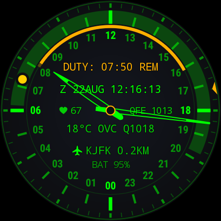 | 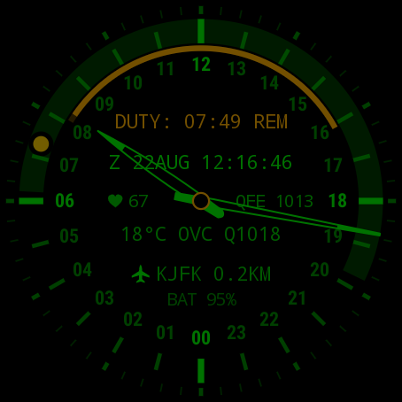 |

*A watch under way at New York JFK. The same face in both shots: always-on is the interactive dial,
dimmed, minus the seconds cursor and the background wash.*

**Wear OS 3.0+ (API 30).** Built and worn on a TicWatch Pro 3 Ultra (454 × 454).
**[Install →](docs/INSTALL.md)**

---

## What you get

| | |
|---|---|
| **24-hour dial** | One revolution per day. Noon up or midnight up. Minutes on their own ring; the second is a cursor that steps, so nothing sweeps. |
| **Watch timer** | Start now or book ahead. An arc spans the hours on duty and dims as they are served; `DUTY: 04:40 REM` counts down. Both boundaries beep and buzz with the screen off. A finished watch clears itself an hour later. |
| **Vigilance monitor** | Off by default. Every 5/10/15 min it wants a sign of life; thirty seconds later it sounds SOS in bursts and leaves `MAN DOWN` with the Zulu moment on the dial. Optional: your pulse during the missed check, against your last moving reading. |
| **Zulu + date-time group** | `Z 22AUG 12:16:13`, the clock a log entry is written in. |
| **Weather** | Temperature, METAR-style condition and QNH. At an aerodrome it is that field's **own METAR**; everywhere else Open-Meteo. Refreshed every 30 minutes. |
| **5 km site lock** | Names the nearest airfield, port, heliport or spaceport from 9,649 sites in a 194 KB on-device index. Military sites are drawn in the accent colour. |
| **Nadir, sun and moon** | Daylight shaded across the hour band, computed offline. The sun and the moon sit at their true hour angles — point a mark at the real thing and the dial is a **compass**. The moon carries its honest phase. |
| **Sensor slots** | Two optional readouts beside the hub: heart rate, the platform's own daily step total, or station pressure. Off by default; they run only while the screen is on. |
| **Always-on** | The same dial, dimmed. `AUTO` thins it to every other pixel after sunset — never during a night watch. |
| **Direct boot** | Draws populated before the watch is unlocked. |

## In action

| A missed check, answered late | Crossing time zones | Waking |
|---|---|---|
| 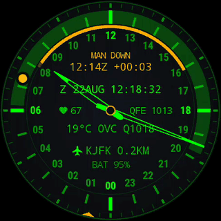 | 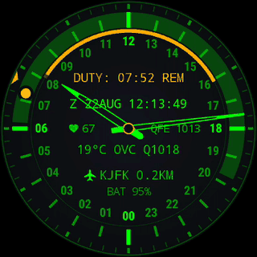 | 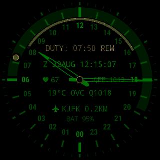 |
| The SOS went unanswered: `MAN DOWN`, the Zulu moment, a mark on the arc. One tap answers with `TAP AGAIN`; a second, inside a second, clears it — a sleeve cannot. | The hour scale glides the short way round the day; the minute hand only takes what is left inside the hour. Remaining duty time never changes. | Only the light arrives. Always-on wears the same hues, so there is nothing to cross-fade. |

## Install

Download `app-earth-release.apk` from the
[latest release](https://github.com/amorroma1/expedition24/releases/latest) and sideload it. Wear OS
has no sideloading UI, so this is an ADB job:

```
adb connect 192.168.1.50:41234
adb install -r app-earth-release.apk
```

Then pick MFD-24 in the watch's own face picker.
**[Full guide — three routes, from a phone-only install to building from source →](docs/INSTALL.md)**

<details>
<summary><b>Updates, and why this is not on Google Play</b></summary>

<br>

The watch checks GitHub **once a day, off duty**, and tells you once per release. It downloads
nothing and installs nothing: **Wear OS does not let an app install an app** (verified on a TicWatch
Pro 3 Ultra). `ABOUT → RELEASES` shows the release page as a QR code for a phone camera, and the
install stays `adb install -r`. `ABOUT → RELEASE CHECK` turns the whole thing off.

It is not on Google Play on purpose: a dead-man's monitor should not be an impulse install, the
permissions it legitimately needs keep a hobby project in permanent store review, and an APK with
its SHA-256 in the release notes is more verifiable than a listing. Full reasoning in
[INSTALL.md](docs/INSTALL.md#why-mfd-24-is-not-on-google-play).

</details>

<details>
<summary><b id="permissions">Permissions — nothing is requested at install time</b></summary>

<br>

Location is asked for from the settings screen, because a watch face is a `WallpaperService` and
cannot raise a dialog itself.

| Permission | For | Without it |
|---|---|---|
| `ACCESS_FINE_LOCATION` | weather, Nadir, the site lock | those three are blank; the clock and the astronomy are unaffected |
| `ACCESS_BACKGROUND_LOCATION` | the same, from the 30-minute refresh job | the platform returns null rather than an error, which looks exactly like no signal |
| `WAKE_LOCK`, `FOREGROUND_SERVICE_HEALTH` | the vigilance monitor, which must keep sensing with the screen off | that feature only |
| `VIBRATE` | shift boundaries and the SOS | silent boundaries |
| `SCHEDULE_EXACT_ALARM` | boundaries landing on the minute | requested but **not** required; without it a boundary can slip a few minutes |
| `INTERNET` | Open-Meteo and METAR every 30 min, plus the daily release check | no weather, no release check |
| `BODY_SENSORS` | the heart-rate slot and the pulse in an incident | dashes; the `LOG PULSE` row is not offered |
| `ACTIVITY_RECOGNITION` | the steps slot; on Wear 5+ also what lets the vigilance service start | dashes; on newer Wear, no vigilance |
| `POST_NOTIFICATIONS` | the monitor's ongoing notice, and the once-per-release update notice | the monitor runs unannounced |
| `READ_CALENDAR` | **Vital only:** the hours the calendar has claimed, marked on the daylight band | that row is not offered; nothing else changes |

No contacts, no storage, and no network beyond those calls. A hand-typed position replaces location
entirely — see **Position** in the settings.

</details>

## Settings

**Long-press the face, then tap the pencil.** Seven collapsible sections, one open at a time; the
open one is outlined.

| Sections | Duty control | Scheduling | Display | About |
|---|---|---|---|---|
| 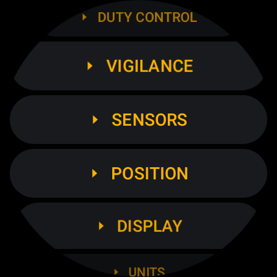 | 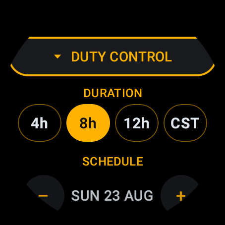 | 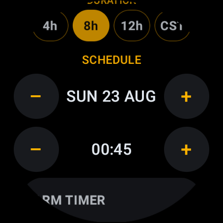 | 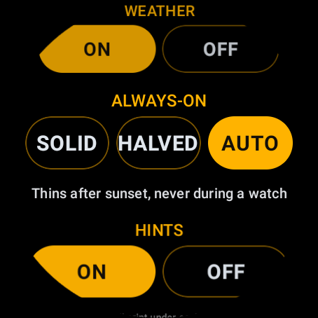 | 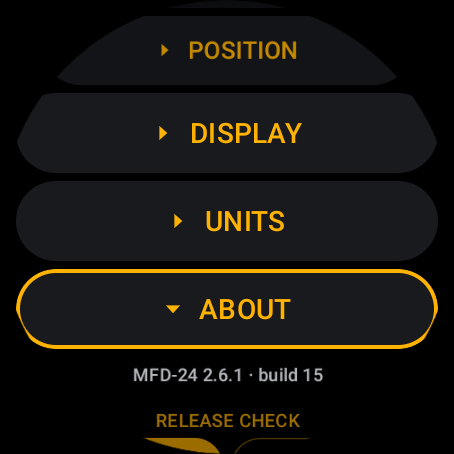 |

- **Duty control** — duration `4h` `8h` `12h` `CST`, a booked start, and one chip reading
  `START NOW` or a terracotta `END DUTY`. A start in the past cannot be booked.
- **Vigilance** — on/off, check interval, `VIBE STRENGTH`, `SOS SOUND` (OFF/LOW/MED/HIGH),
  `LOG PULSE`, and the incident log with its export.
- **Sensors** — what each hub slot reads.
- **Position** — automatic, or coordinates typed by hand.
- **Display** — palette, dial top, midnight mark, Nadir, sun and moon marks, weather, always-on,
  and `HINTS` for the small print under each row.
- **Units** — °C/°F, hPa/mmHg.
- **About** — version, the repository as a QR, the release check.

**[Every row, with the reasoning →](docs/DESIGN.md#settings)**

## The dial, in detail

|  | 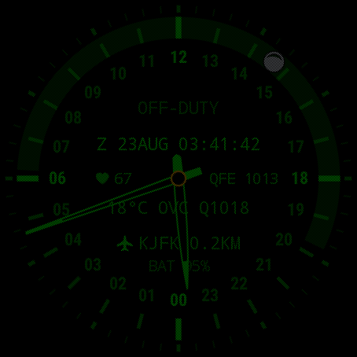 | 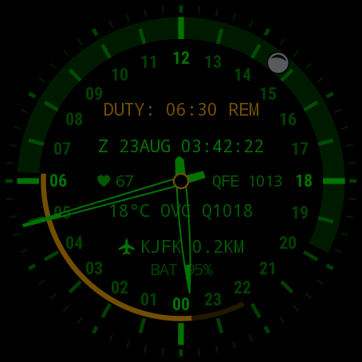 |
|---|---|---|
| Mid-watch: the arc is the shift, the bright part is what is left to serve. | `ALWAYS-ON > AUTO` thins the face after sunset — half the light, half the burn-in duty cycle. | A running watch keeps the full face all night: a night duty is exactly when the dial is read in the dark. |

**[How it works — layout, astronomy, the vigilance state machine, the tests →](docs/DESIGN.md)**

## MFD-24-Vital

The same dial, turned on the wearer instead of the watch: a separate face that installs **beside**
MFD-24 and spends its twenty-four hours describing a day rather than a shift. Built for looking at
in the morning and deciding what to do differently — not for counting, and not for grading.

| The day, three rings deep | The day read back |
|---|---|
| 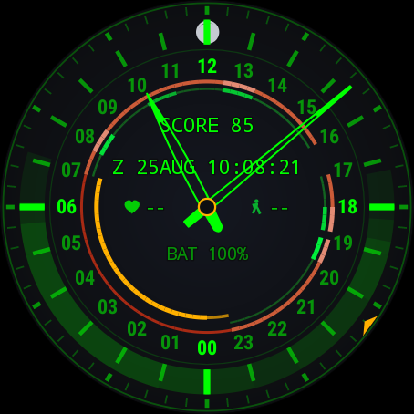 | 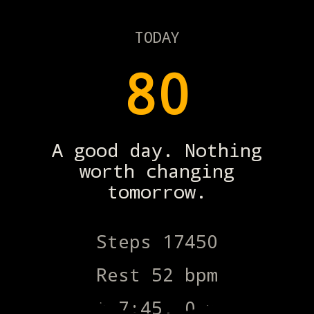 |

*A staged day on the emulator, so the rings have something to show: a night, a walk to work, a
sedentary morning, a lunchtime walk, an evening run. The hour hand's tip runs on the outermost of
the three rings; behind it is the day already lived.*

| | |
|---|---|
| **Three rings at the hand's point** | Pulse outermost, then activity, then sleep. Each quarter-hour states its value twice — in the hue and in the **weight of the line** — because colour alone has to shout to be read at a glance, and a dial that shouts all day is one you stop looking at. Pulse runs maroon → coral → rose by rate; activity deep green → phosphor by effort, which is the greater of what the feet did and what the heart did, so a hard half-hour that takes no steps still shows; sleep is one amber whose depth is brightness alone. |
| **The ring's leading edge is live** | Half an hour of ring ahead of the hand is left clear, so the arc has a seam where *now* is — the rings carry a rolling twenty-four hours, and without it the day runs straight past the hand's tip into yesterday. The quarter-hour under the hand is painted from the reading on the dial rather than from the last one the recorder closed — and the pictograms beside the hub wear those same two colours. The heart is the colour of the arc under the hand and the walking figure the colour of the activity ring, which is the shortest legend available: you learn the scale from a number you already read. |
| **Gaps mean gaps** | A quarter-hour nobody watched is drawn as nothing. "The watch was off" and "you did not move" are different claims, and the face never blurs them — which is also why an unmeasured day shows dashes rather than zeroes. |
| **The day's score, and what to change** | `SCORE 85` above the hub; a double tap opens the report — the score, up to three things worth changing tomorrow, and the figures they came from. Steps and sleep carry forty points each because they are what tomorrow can be different about; the pulse carries twenty. |
| **The band says when** | One arc for the day, sunrise to sunset, exactly as the duty face draws it — one weight and nothing painted inside it. It has carried more: cloud shading hour by hour, then twilight wedges either side, and each addition cost the band a little of the one thing it is for. On top of it, the next alarm as a notch — the one the platform will actually ring, dropped the moment it has fired — and the hours the calendar has claimed, as short arcs on the outer edge. |
| **The watch timer and the monitor stay** | A wellness face still stands watches: the duty arc, the vigilance escalation and the incident record work exactly as they do on MFD-24. What is gone is the standing `MAN DOWN` across the dial — the hub's accent and the log carry it instead. |

### Reading the day back

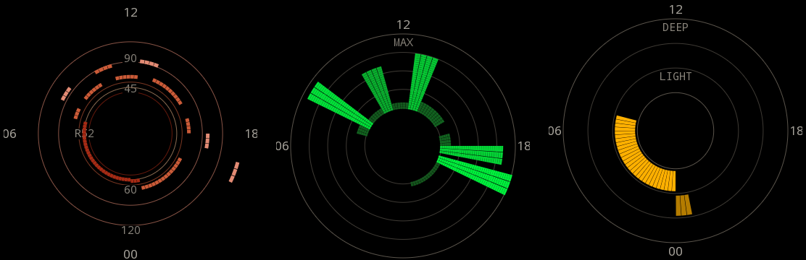

*Pulse, effort and sleep, from the same staged day: the night low and to the left of midnight, the
walk to work and the evening run standing out to the rim, the night again as one amber run.*

`RECORDER → GRAPHS` draws the three records the way the dial draws them — round, a mark every
quarter-hour, in the face's **own** orientation and with its own name for midnight, over the
**same rolling twenty-four hours the rings carry**: today up to the hand, then yesterday ahead
of it. Midnight to midnight would cut a night that began at nine in half, and last night is
most of what somebody opens these for. Two schematic hands sit over each dial at the hour and
minute the face is showing, so the seam between today and yesterday is where the hand points
and nothing has to be counted round from midnight. The circles are the scale: 45, 60, 90 and 120 bpm
plus the wearer's own resting rate on the pulse dial, quarters of the day's effort on the activity
dial, three depths on the sleep dial.

The pulse is drawn as a **smoothed line**, coloured by the zone each reading falls in, on a
**logarithmic axis whose ends come from the day itself**. Logarithmic because a pulse is a ratio —
fifty to sixty is the same distance as a hundred to a hundred and twenty — and from the day because
a fixed axis has both faults at once: a quiet day flattens into a circle, and a hard one gets its
peak clamped against the rim, which is a graph lying about the one moment anybody looked for. A
guide circle outside the day's range is not drawn.

All three are drawn the same way, and that is deliberate: three panels in three grammars cost the
reader a second of working out which is which before they can read anything. Effort runs from the
inner circle out, sleep through its three depths, and a quarter-hour that was watched and found
still sits on the floor rather than leaving a hole.

The line breaks wherever the record does. It is only drawn between two quarter-hours that were both
measured, so the platform's thin hours stay holes rather than an invented heartbeat, and it breaks
again at the seam where today meets yesterday.

**Sleep, inferred honestly.** From a wrist that is worn, still, and running a pulse in the range
its own floor allows — the floor being the tenth percentile of the day's own readings, so the
athlete resting at 45 and the smoker resting at 78 each get their own bar. Four rules, each put
there by a night the model got wrong:

- **The pulse only ever says *awake*,** and only when it is well clear of that floor. A
  quarter-hour with no reading is still a candidate, because the platform thins the night's
  samples exactly when it idles hardest. Getting this backwards turned seven and a half hours in
  bed into an hour and a half in pieces.
- **A night *begins* on a genuinely still quarter-hour and *continues* through movement.** Sixty
  steps under a duvet is a body asleep; sixty steps on a sofa is an evening, and without the
  distinction one opened a night at eight in the evening and ran it to morning.
- **A quarter-hour nobody watched is bridged, not charged to the wearer.** It neither ends the
  night nor counts as time spent out of bed.
- **By day the bar is higher.** A nap has to run within a sixth of the floor and has to have a
  reading at all — otherwise a sedentary morning at a desk comes back as ninety minutes of sleep.

What it costs is the far edge: a still, quiet hour after waking can be read as another half-hour of
sleep. That is the deliberate side to be wrong on. Quarter-hour edges, no naps under half an hour,
no phases beyond three depths of brightness, and no claim whatever to be a sleep study.

**A night you can declare.** `RECORDER → TRACK SLEEP`: one tap going to bed, another getting up.
Inside a declared night the model stops second-guessing — an evening at nine counts, a turn of the
wrist does not end it, and a watch left on the bedside table is read as sleep. It is there because
the two cases a wrist cannot settle are settled by the wearer in one tap: an evening on the sofa
and an early night look identical from a watch, and so do a bedside table and an empty room.
Sixteen hours and the session closes itself, so a forgotten tap costs a morning rather than a day.

**Sleep off the wrist, if asked.** A watch spent on the bedside charger can still be read as a
night — `RECORDER → SLEEP OFF WRIST`, off by default. Off a wrist there is no pulse and no phases,
only the fact that nothing moved, so the claim is confined to the night hours and to stretches of
two hours and more, and a watch face down on a desk over lunch gets nothing. It is the weakest
reading this face makes, and it exists because somebody who charges overnight otherwise gets a
blank.

**The record leaves whole.** `RECORDER → EXPORT RAW` puts two days of the grid itself — every
quarter-hour's flags, pulse and steps, nothing inferred — on the screen as a QR code and out of the
speaker as 1200-baud tones: 388 bytes a day fixed, about 180 deflated, which is why two days fit one
code and a week does not. `tools/vital/decode_day.py` turns either channel back into a CSV. It
exists so that when a night comes back wrong the argument can be had against the numbers rather
than against a screenshot of a conclusion — every rule above was settled that way.

**What it costs, and what it does not do.** Recording is **off by default**: it runs a foreground
service for the life of the day and lights the optical LED for about twenty seconds every five, ten
or fifteen minutes, which is a thing to be asked for rather than assumed. Steps come from the
hardware counter, so they cost nothing, and the quarter-hours are timed by inexact alarms that let
the watch sleep — Doze can stretch a tick to nine minutes and the totals still come out exact,
because every bin is the difference of two cumulative readings. Nothing is uploaded anywhere: no
account, no companion app, and no network call in any of this beyond the same forecast the duty
face fetches. And nothing here is a medical instrument — the strongest thing it will ever say is
that a pattern has held for three days and a doctor might want to hear about it.

**What this face drops from MFD-24**, because a day is not a watch: the weather row and its unit
settings (the forecast survives only as the band's shading), the 5 km site lock and the whole
on-device site index, and the duty and incident *text* rows — the arc and the record remain.

Build it from the same tree — `./gradlew :app:assembleVitalRelease` produces `app-vital-release.apk`
— and sideload it exactly like the Earth face.

<details>
<summary><b>Footnotes — the step count, the hardware it needs, and what it weighs</b></summary>

<br>

**How the step count is arrived at.** The row prefers the platform's own daily figure, through
Health Services, because that is the number the rest of the watch agrees with and it does not care
when this face was installed. Where a watch has no such provider, or the provider binds and then
says nothing, the face counts for itself from the hardware step counter. That fallback is exact
**from the next local midnight onward**, because the counter's value is recorded at the day
boundary; on the day you install it, it can only count from the moment you switch the slot on, and
it shows dashes rather than a `0` it would have invented. One watch tested here reports its "daily"
total as steps since the subscription began rather than since midnight — a provider quirk, not a
setting, and the reason the row is worth reading as *steps counted*, not as a fitness statistic.

**Screen.** Round, and tested at **454 × 454**. Every position on the dial is a fraction of the
radius, so other round sizes should be fine; square and chin-cut screens are not designed for and
will crop the outer scale. Text is sized from the radius too — the readout width budget is
arithmetic and there is a test that fails if a row would reach the hour numerals.

**Hardware and performance.** Wear OS 3.0+ (API 30), any watch the platform runs on; no GPU
features beyond an ordinary canvas. `render()` allocates nothing, so there is no garbage collector
pause to schedule around, and the frame rate is demand-driven: **one frame a second at rest**,
16 ms only while a transition is animating, and one frame a minute in always-on. The optional
sensors are the only real cost — heart rate is an LED, and the vigilance monitor keeps the
accelerometer batching in the sensor hub rather than waking the processor. Everything else runs off
cached values.

**Size.** About **3.5 MB** installed, of which roughly 2.8 MB is code, 190 KB the on-device site
index and 220 KB the picker preview. The index is stored uncompressed on purpose so it can be read
without unpacking. English resources only: the app's own text is English, and carrying eighty
locales of library strings it can never display cost 260 KB.

</details>

## What it is not

A personal instrument, not a certified one. The vigilance monitor is an uncertified aid: it can be
switched off, suspended by a loose strap, or delayed by the platform's own doze limits. The incident
log covers **one watch** — starting another empties it, so anything worth keeping leaves via
`EXPORT LOG` first. Nothing here substitutes for a device a regulator has approved.

## Build

```
git clone https://github.com/amorroma1/expedition24.git
cd expedition24
./gradlew :app:assembleEarthDebug
```

JDK 17+ and the Android SDK. Two flavors share the tree — `assembleEarthRelease` and
`assembleVitalRelease` — and each has its own test task:
`./gradlew :app:testEarthDebugUnitTest :app:testVitalDebugUnitTest`.

## Licence

GPL-3.0-or-later — see [LICENSE](LICENSE). Naval bases and heliports are derived from OpenStreetMap
(© OpenStreetMap contributors, **ODbL**), so any index built from them carries that licence too;
airports, ports and spaceports are curated in this repository. Weather from
[Open-Meteo](https://open-meteo.com/) (CC BY 4.0) and
[aviationweather.gov](https://aviationweather.gov/) (US NOAA, public domain).
