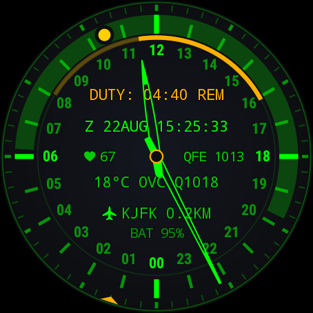

# MFD-24 — how it works

[← back to the README](../README.md)

The long half of the documentation: what is drawn where, why each number is computed the way it
is, and which decisions are load-bearing. Nothing here is needed to *use* the watch face — it is
for reading the code, reviewing a change, or settling an argument about a corner case.

---

## Layout

```
tickwath3pro/
  shared/kotlin/…/geo/            Morton.kt, PoiFormat.kt — compiled into BOTH the app and the
                                  packer, so the reader and the writer cannot disagree
  tools/poi/                      CSV sources + the binary packer (JVM, no Android)
  app/src/main/kotlin/…/
    MfdWatchFaceService.kt        service, lifecycle, direct-boot handling
    MfdRenderer.kt                the frame loop
    WatchShiftReceiver.kt         end-of-watch alarm
    render/                       Geometry, DialLayer, HandsLayer, SecondsMarker, DutyArcLayer,
                                  DaylightLayer, TelemetryLayer, AmbientLayer, AmbientAuto,
                                  SiteGlyph, Glyphs, DialTransition, WakeTransition
    astro/                        AstroTime (dial angles, the UTC date-time group), SolarTime
                                  (sunrise/sunset), MoonSky (phase and hour angle)
    geo/                          PoiDatabase (Morton range query), PoiResolver, Geo (haversine)
    data/                         TelemetryRepository/State/Store, ResolveOrigin, LocationRepository,
                                  OpenMeteoClient, MetarClient, WeatherCache, TelemetryWorker,
                                  WatchShift (timer state + alarm), Alerts (beep and buzz),
                                  SensorSlots, DailySteps, MotionFilter, VigilanceService/Monitor/
                                  State/Store, SosSchedule, SosSignal, IncidentLog
    export/                       LogPacket, QrCode, QrPanelView, Afsk, Callsign, LogExportActivity
    update/                       ReleaseCheck, UpdateStore, UpdateNotifier, ReleaseLinkActivity
    style/                        UserStyleSchema and the resolved Palette
    text/TextBuf.kt               allocation-free number and text formatting
    editor/WatchConfigActivity.kt on-watch settings (Wear Compose)
```

## How it works

### The 24-hour dial

The whole face hangs off one mapping — screen angle for an hour, clockwise from 12 o'clock:

```
angle = hours / 24 * 360 + 180
```

The half-turn is what fixes noon at the top and midnight at the bottom, putting 06:00 on the left
and 18:00 on the right. **Dial top** drops that half-turn and flips the whole 24-hour axis so
midnight sits at the top instead. The flip is a single term in one function, so everything keyed to
the hour scale — ticks, numerals, hour hand, watch arc, Nadir band — turns with it, while the minute
ring stays put because its zero is a minute, not an hour.

The minute hand turns once per hour of the selected world and the seconds cursor once per minute of
it, both derived from the same `hoursOfDay` value, so all three modes go through one code path.

### Crossing a time zone

A shift is stored as two absolute instants, so nothing about its length or its remaining time
depends on where you are: fly three zones east mid-duty and `DUTY: 02:00 REM` is still exactly two
hours. Only the *mapping* onto the dial uses the current offset, and it uses it for everything at
once — hour hand, both ends of the watch arc, the edges of the daylight band — so they all slide by
the same amount and the intervals between them never change. `TimeZoneShiftTest` pins that,
including half-hour zones.

The slide is eased over four seconds rather than snapped, and the interesting part is *what* gets
eased. The obvious move is to ease the offset and let it carry the dial, which works — and also
drags the minute hand through a full revolution per hour of change, because the minute hand is the
fractional part of the same number. So the offset is eased twice at two different moduli: the hour
scale takes the whole change the short way round a day, the minute hand takes only what is left
inside an hour, which is nothing at all for most of the world and half a turn for the half-hour
zones. Seconds never move; no zone offset has a fractional minute in it.

Going the short way round a day is what keeps the date line honest. Apia to Pago Pago is a
twenty-four hour change that leaves the dial reading the same hour, and easing the raw difference
would spin the hand a whole gratuitous turn. `DialTransitionTest` measures the travel distance of
each hand for exactly these cases.

### Nadir

With **Nadir** on, the hours between sunrise and sunset at the wearer's position are shaded across
the hour-tick band, in the palette's own hue at low alpha — moss under green, terracotta under amber,
oxblood under red. It was a fixed teal once, which clashed with every hue but the one it had been
picked against, and carried blue besides, so always-on could not use it at all.

**The sky marks turn the dial into a compass.** With `SOLAR MARK` on, the sun is drawn at its
true **hour angle** — `12 h + HA` on the 24-hour scale, computed from the daylight window's own
transit, so the equation of time and your longitude-versus-zone offset are priced in. That
last part matters: a mark at the *clock* hour would sit exactly under the hour hand and add
nothing to the old point-the-hand-at-the-sun trick; hour angle is what the extra few degrees of
accuracy actually live in. To orient: hold the watch flat and turn it until the mark points at
the real sun — the dial's noon now faces the equator (south in the northern hemisphere, north in
the southern), and every bearing reads off the 24-hour scale. `LUNAR MARK` is the same compass
for the night: the moon at its own hour angle, from a truncated lunar theory good to a third of
a degree, drawn grey and outlined with its **honest phase** — the lit side faces the sun's mark,
because that is where the light comes from. Both marks are zone-free (the sky does not know what
time zone it is under, so neither moves when the scale glides across a border) and both are
honest about their limits: no position, no band, no mark — and each leaves the dial while its
body is below the horizon, because a compass with nothing in the sky to point at is not a
degraded reading, it is no reading.

Sunrise and sunset come from the standard low-precision solar model
in `astro/SolarTime.kt` — pure arithmetic on UTC milliseconds, so it is unit-tested against published
day lengths and handles polar day and polar night explicitly. It is computed when the position or
the date changes, never per frame. The band itself is drawn each frame between the two cached dial
bitmaps — under the ticks, over the background — which is what lets it slide while a change of
position eases in.

The band shades the dial's own day: the hours the sun is up, at your position, on this scale.

### Two scales, two rings

24 hours and 60 minutes share no useful divisor, so they do not share a track. The **outer ring**
carries 60 divisions — one per minute of the minute hand's revolution and one per second of the
seconds cursor — graduated so that every fifth is heavier and brighter, which is what lets the eye
land on a five without counting round from the top. The **inner ring** carries the 24-hour scale:
its ticks all spring from the same inner circle and grow outwards, cardinals reaching further,
stopping short of the minute ring so the gap reads as deliberate. The hour numerals sit inside that
circle.

### Seconds without a second hand

There is no second hand and no filled seconds ring — only the current second is lit, as a triangular
cursor with its apex pointing at the hub, stepping from one minute tick to the next. That is why the
fine ring is 60 divisions rather than the 96 quarter-hours a 24-hour dial would otherwise suggest:
96/60 is not a whole number, so a seconds marker keyed to 96 ticks can never land dead centre on one.
The cursor's base is slightly wider than the tick pitch, and its depth is a fixed 8 device pixels
rather than a fraction of the radius — it is a hairline detail that should not scale with the dial.

### The watch (shift) timer

Start a watch — now, or booked for a date and time — and an arc appears on the inner circle,
spanning from where the hour hand stood when it began to where it will stand when it ends. The
elapsed part dims; the bright part runs from the hand's current position to the end, so the arc is
both the shape of the shift and the time still to serve. Length is four hours, eight, twelve, or
anything up to sixteen in five-minute steps.

|  |
|---|
| An eight-hour watch, just begun. The arc runs 13:56 to 21:56 and `DUTY: 08:00 REM` says the same in words. Nothing is dim yet because nothing has been served. |

The readout above the hub says which of four things is true:

| State | Reads | Arc |
|---|---|---|
| nothing set, or cancelled | `OFF-DUTY` | none |
| booked, not begun | `DUTY IN 4:30` | whole span, bright — once it is near enough to read |
| under way | `DUTY: 2:29 REM` | span dim, time still to serve bright |
| served | `OFF-DUTY` | whole span in grey |


**A booked watch keeps its arc off the dial until it can be read.** The dial is one revolution of
the day, so an arc carries no date: a watch booked for the day after tomorrow drew within a degree
or two of the same watch booked for tonight, and read as imminent. It looked right, which is worse
than looking wrong. Until the arc can mean something the readout carries it alone — `DUTY IN 48:00`
says exactly the thing an arc cannot.

The rule is stronger than "not more than a day away", and it is a single property: **the hour hand
is never inside a booked arc.** Work it out on the dial and the hand stands inside the span exactly
while the start is between one revolution and one revolution *less the watch's own length* away —
and at the far end of that window it stands precisely on the arc's end, which is the moment a booked
watch stops being distinguishable from one under way. So the arc waits until a turn less the length,
and one hour of dial further for clearance: it appears with the hand an hour past where the arc
ends, and from there the hand only approaches the start from outside.

| Watch | Arc appears | Sweep |
|---|---|---|
| 4 hours | 19 hours ahead | 60° |
| 8 hours | 15 hours ahead | 120° |
| 12 hours | 11 hours ahead | 180° |
| 16 hours | 7 hours ahead | 240° |

A long watch is therefore announced later than a short one, which is the arithmetic being honest
rather than a compromise: a long arc covers more of the dial, so there is less of the dial left to
stand outside it. Everything is counted in turns rather than hours because the ambiguity is one of
revolutions of the dial, which is what the arc actually draws on.

A served watch keeps its arc for **one hour** and then leaves the dial of its own accord. That hour
is for the handover — "what did I just serve" is a question asked immediately or not at all — and
after it the shift is over in the only sense the dial can express: a watch that ended at breakfast
still drawn at dinner is furniture, and worse, it is furniture that looks like a shift. Cancelling
clears it on the spot, because that was a decision rather than a completion.

Both boundaries sound a short beep and a short buzz. They are `AlarmManager` alarms, not something
the renderer notices, because the renderer is not running when it matters — in ambient it draws once
a minute and with the screen off it may not draw at all. Delivery is made idempotent: a wall-clock
jump makes the platform re-deliver a due alarm, and the user should hear one chime, not three.

The duty timer runs on the wall clock rather than on the instant the renderer is asked to draw.
Headless preview instances render at a fixed representative time, and measuring a real shift against
that produced a countdown of several hundred thousand hours in the watch picker.

### The vigilance monitor

A dead-man's check, off by default and available only while a duty is under way — it exists to watch
someone on watch. Every 5, 10 or 15 minutes it wants a sign of life: an arm movement, a tap on the
face, or the screen being woken. Nothing answers within thirty seconds and it sounds SOS
(`· · · — — — · · ·`) on the speaker and the vibrator together, the **vibration** climbing each
cycle. The volume does not climb: it is the level the wearer chose, and an alarm that overrides its
own setting is an alarm that gets switched off for good.

The SOS is sent in **bursts**, not as one continuous five-minute alarm: thirty seconds of calling
while somebody might still be in the room, then a doubled SOS once a minute, four times. Six
signalling events in all counting the nudge, and between them the watch is silent — a distress
signal is shout-then-listen, and the charge that a continuous alarm would burn is charge the
record needs. Each burst is **felt once, then sounded twice**: a vibrating case drowns its own
speaker, so the wrist is told first and the room after. `SOS SOUND` sets the volume, `OFF`
included — the wrist and the record work in silence.

**The SOS stops after about five minutes; the incident does not.** By then anyone within earshot has heard
it, and what the watch does next needs the battery more than another hour of beeping does: it goes
quiet and holds the incident on the dial — `MAN DOWN` above the hub and `21:14Z +02:13` in place of
the duty row, being the Zulu moment the operator stopped answering and how long ago that was. The
record is written to device-protected storage, so it survives a reboot, a flat battery and a charger,
and it is readable before the watch is unlocked, which is exactly when somebody else is holding it.

Clearing an incident takes **two taps** within about a second. Not one, because a sleeve or a harness
should not be able to erase the only record of what happened; and not a long press, because on Wear
a long press on the watch face belongs to the system, which opens the face picker with it — a watch
face never sees the hold. The gesture announces itself: the first tap swaps the status line to
`TAP AGAIN` for a couple of seconds, because whoever is looking at `MAN DOWN` for the first time is
not in a position to go looking for a manual.

**Beginning a watch clears the incident in force.** Starting a shift is a deliberate act by somebody
demonstrably conscious, which is as good a signature as two taps; and an incident carried into the
next watch does more than look wrong. It settles the monitor into the incident state instead of
arming it, so a new shift would begin with no dead-man's switch at all and a full hub core to say so.
The record itself is not lost — only the incident *in force* is cleared, and the log keeps the entry.

#### The incident log

Every unanswered escalation is appended to a log in the same device-protected storage, and **the
log covers one watch**: starting a new one empties it. That is the scope this instrument claims. A
finished shift is the moment its record is read — "how did that go" — and by the time another shift
begins the answer has either been taken or was never wanted. The watch's own start, end and booked
length are stored beside the entries and printed above them, because an instant on its own is
detached from the shift it happened in: `20:22Z` cannot say whether that was ten minutes into a
night watch or the last hour of a sixteen. Beneath the per-watch rule sit two backstops — **32
entries**, oldest dropped first, and **30 days** — and a backwards clock jump prunes nothing,
because for a record the direction that hurts is loss.

The **vigilance** section of the settings lists the entries, newest first, in the same Zulu the dial
prints, with `CLEAR LOG` under them. That listing is the only way in: the record lives in
device-protected preferences, and a release build offers no other route to it.

**This is a watch for people who stand watches, not a certified recorder.** If the job needs a kept
journal — every shift, retained, auditable — that is a different feature with different promises,
and it should be asked for as one rather than inferred from a log that happens to survive.

#### The pulse in an entry

With `LOG PULSE` on, an entry carries two heart rates instead of none: the one measured during the
unanswered check, and the last one taken while the wearer was moving, with the instant it was taken.
The editor prints them under the time — `HR 41 · REF 58 20:12Z` — and the exported packet gives them
their own columns.

**The pulse is recorded, never acted on.** Nothing in the escalation reads it: a low reading does
not raise an alarm, a healthy one does not cancel one, and the state machine behaves identically
whether the row is on or off. It is there because "stopped answering at 21:14Z" and "stopped
answering at 21:14Z with a pulse of 41 against a resting 58" are different things to hand to whoever
arrives — and deciding anything from an optical pulse taken through a strap on an unconscious wrist
is a claim this watch has no business making.

It is offered only where it can be honoured. The row appears in the settings only once
`BODY_SENSORS` has been granted, because a switch that cannot do anything is worse than an absent
one. An absent reading prints nothing rather than a dash: a sensor that never locked on must not be
readable as a pulse of zero. A log written by an earlier release, with no pulses in it, reads back
unchanged — the format grew a suffix rather than a new shape.

#### Getting the log off the watch

Anything wanted out of the current log has to leave before the next shift starts, and a watch has no
share sheet, no file manager and no cable that carries data on this hardware. So `EXPORT LOG` puts
the same bytes on the two channels a wrist actually has:

- **A QR code**, for the phone camera already pointed at it. The encoder is in-repo
  (`export/QrCode.kt`, byte mode, level L, versions 1–20, one fixed mask) rather than a
  dependency — the log is bounded, so the encoder is bounded to match, and a library that also
  decodes, styles and streams would be several hundred kilobytes to draw one bounded packet.
- **Sound**, as Bell 202 AFSK — 1200 baud, 8N1, the physical layer APRS uses, so the receiving end
  is `minimodem --rx 1200` and nothing else. Async framing rather than AX.25, so no TNC is needed.
  It is there for the case where the phone is the thing that is missing: a handheld radio held to
  the case, and the log arrives wherever that radio does.

Both carry one packet, built once by `LogPacket.build()`, so a photograph and a recording of the
same export cannot disagree. Its `END` line carries the entry count and a CRC32 of everything above
it, which is what makes a blurred photograph or a noisy recording fail loudly rather than quietly
lose a line. The transfer is **read-only by construction**: there is no import path, so nothing
that reads a packet can write the record.

The packet's second line names the instrument: a **callsign** derived from a salted SHA-256 of the
watch's own `ANDROID_ID`, mapped onto `PREFIX-NN` plus a short hex id, and printed over the QR.
Identity lives at the exit only — the stored log is pure instants — which keeps the record itself
free of anything about the wearer while still letting two exported packets be told apart. The prefix
list and the salt are part of every identity issued: reorder or re-salt them and every watch in the
field is renamed.

#### The marks on the duty arc

Each incident belonging to the watch under way is drawn as a **notch across the duty arc**, at the
angle of the hour it happened. The count is the point. One missed check is an event, and the dial
already spells that one out in words; three notches by the fourth hour is a picture of somebody
failing, and there is nowhere else on this face that a *count* would fit. The marks are filtered by
the shift's own window rather than cleared by anything, which is why last watch's marks are simply
not on this watch's arc.

**The mark takes the third hue.** There are exactly three blue-free hues on this face; a palette
spends two, one on the dial and one on the accent, and the mark takes the one left over — green
unless the dial is green, in which case red. Note that this is *not* the opposite of the dial's
colour, which is the obvious first guess: under the amber palette the accent, and therefore the arc,
is already red, so a red mark would be exactly as invisible there as an accent-coloured one. What
has to be avoided is the arc's hue, not the dial's.

Two earlier attempts failed the same way. The accent made the mark a slightly brighter piece of the
arc, because the accent is what the arc is drawn in; the lume, standing proud of the band with a
halo, was legible but untidy, and caught the eye rather than being read. The mark now fills the
band's own cross-section exactly — no overshoot, no halo, the same thickness as the arc — and
separates by hue alone.

#### Off the wrist

A watch on a table cannot fail to respond, so every nudge it is sent is a false one — and a false
nudge at three in the morning is how a dead-man's switch gets switched off for good. This is the
largest single source of false incidents, so vigilance suspends while the watch is not being worn.
The hardware makes it nearly free: the off-body detector is an on-change wake-up sensor needing no
permission, and this watch already runs it for four other clients.

The risk that buys is stated rather than hidden. A detector reporting off-body while the watch is
*worn* — a loose strap, a sleeve — stops the monitor watching a wrist that is still there, which is
the unsafe direction. So this is the one suspension the dial announces: `OFF WRIST`, in the readout's
dimmer tint rather than the accent, because it is information and not a demand. Suspending on a
charger says nothing, since a watch on a charger is self-evidently not being worn.

#### What the hub and the arc say about it

**The hub says where the interval is up to.** Its core fills with the accent as the countdown runs —
empty just after a movement, full when the answer is due — and grows a second ring outside itself
while the SOS is sounding. Before that, an armed monitor and a switched-off one looked identical, and
there was no seeing whether a nudge was thirty seconds away or four minutes.

The core fills **only** while an answer is owed, and nothing else may claim it — which is why an
incident, the worst state of all, leaves it empty: the words above the hub carry that one. Filled, an
incident read as a thirty-second demand that would not go away, and since core and ring share a
colour, a full core is a solid disc with no ring visible at all.

**Two cues say that nothing is watching**: the hub ring dims, and the time still to serve is drawn as
a thin line inside the arc's band instead of filling it. Two, because an empty core alone is
ambiguous — it is also what a monitor that has just been answered looks like. The arc was not the
first plan; the hub seemed the natural home on the argument that the arc is the shift's and the hub
is the monitor's. But the hub is eight pixels under the hands, and this is a safety state: the arc is
the largest thing on the face and the only part of it that reads without looking.

The two cues differ on one case, deliberately. An incident thins the arc, because nothing *is*
watching until it is cleared — but it does not dim the hub ring, because an incident is not a quiet
suspension and the accent is what says so. Both appear only where vigilance was switched on, so a
face that does not use it is unchanged.

Nothing about the indicator animates. A strobe would be invisible in always-on, which redraws once a
minute, and in interactive it would pin the frame rate at 16 ms for the length of an alarm — spending
battery to advertise a feature whose whole point is saving it.

#### Telling a wrist from a ship

The problem is not detecting motion; it is detecting motion on a bridge or a flight deck, where the
accelerometer never rests. `MotionFilter` band-passes the magnitude of acceleration to **0.5–3 Hz**,
with two poles a side rather than one: below the band is gravity, posture, and the slow heave of a
hull; above it is engine, rotor and road buzz. A single pole rolls off at 6 dB per octave, which
leaves a ten-second five m/s² roll putting a quarter of itself into the band; twelve dB per octave
drops the same roll to a few percent. Movement has to persist across samples, so a single knock does
not answer on the operator's behalf.

The **sample rate is set by the noise, not by the signal.** Nyquist for a 3 Hz band suggests 7 Hz
would do, and the accelerometer will run as slow as 13 Hz, which looks like free battery. It is not:
sampling at 13 Hz folds 12 and 14 Hz engine noise onto **1 Hz**, dead centre of the arm-movement
band, where nothing downstream can tell a rotor from a wrist. Rejection would then rest entirely on
the sensor's own anti-alias filter, which cannot be inspected or tested from the app. So the rate
stays at 50 Hz, and a test asserts the rule rather than the number.

For a dead-man's switch the dangerous error is a false *alive*, which is also why none of the cheap
hardware wake-up triggers is used. This watch offers Significant Motion and a wrist-tilt detector,
both free in power terms, and both of which a moving vehicle sets off continuously — reporting an
unconscious operator as awake for as long as the ship is under way.

#### What it costs

**It has to be a foreground service.** A watch face is a `WallpaperService`, and a wallpaper stops
receiving sensor events once the screen goes off — which is precisely when a dead-man's check
matters. So vigilance runs as a foreground service of type `health`, with the ongoing notification
that entails. Two platform grants come with that, and the editor collects them at the moment
vigilance is switched on rather than at install: `ACTIVITY_RECOGNITION`, without which
`startForeground` throws on API 34+ and the service stops itself rather than crashing the face, and
`POST_NOTIFICATIONS` on API 33+, without which the service runs unannounced. A watch face cannot
raise a permission dialog itself, which is why the switch and the request live in the same row.

It used to hold a `PARTIAL_WAKE_LOCK` for the whole watch, keeping the application processor awake
for hours to look for a signal below 3 Hz. Two changes removed that without giving up a single
sample:

- **Twenty seconds of batching.** The accelerometer here is a *non-wakeup* sensor with a 2016-event
  FIFO, so the sensor hub accumulates while the processor sleeps and hands the run over when
  something next wakes it. One interrupt every twenty seconds rather than fifty a second. 50 Hz for
  20 s is about 1000 events, well inside the FIFO, which matters because the app is not the only
  client on that sensor.
- **The wake lock only while an answer is owed.** Nothing is held while armed; the end of the
  interval is an `AlarmManager` alarm, which fires with the processor asleep. The lock is taken when
  the nudge goes out and released when the monitor re-arms, so it is held for the thirty-second
  answer window and any alarm, rather than for the whole watch.

A gap in the samples resets the filter instead of reading as stillness: a batch that never arrived is
missing evidence, not evidence of absence. The failure direction is a nudge that need not have been
sent, which is the safe way round.

One platform limit to know about: while the watch is in Doze, an exact alarm is allowed no more than
once every nine minutes per app, so a five-minute interval can stretch. The escalation still happens,
late rather than never, and the ten- and fifteen-minute intervals are clear of the limit.

On charge the whole thing suspends — a watch on a charger is off a wrist — and the sensor is
unregistered outright rather than batching events nobody will read.

### The readout

Bare type printed on the dial — no window, no fill, no frame — in one size and one weight, split
either side of the hub:

```
            DUTY: 07:50 REM
         Z 22AUG 12:16:13
      ♥ 67   ( hub )   QFE 1013
           18°C OVC Q1018
          ✈ KJFK 0.2KM
              BAT 95%
```

The zulu row carries an ICAO date-time group — day, three-letter month, time, all UTC — behind the
bare `Z` prefix a date-time group actually uses. At 16 characters it ties with the weather row for
the longest line the readout can produce, so it takes the inner slot of the upper block where the
dial is widest.

The type is sized from those two lines — `Z 22AUG 12:16:13` and `-40°C TSGR Q1013`, sixteen
characters each — and placed so that even their corners clear the hour numerals with about 15 px to
spare on a 454 px dial. `Geometry` carries the arithmetic.

Each glyph is laid down twice, first as a background-coloured outline and then as fill. The dial
carries no NOON/MORN/EVE/MIDNIGHT wording: the heavy cardinal ticks and the numerals already say it.

The hands are skeletons for the same reason — a thin contour along the body, solid only at the point
and the counterweight. Printed type under a filled hand is simply gone for part of every hour;
hollowed out, it reads straight through the shaft while the solid tip still lands unambiguously on a
mark. The solid caps are cut from the silhouettes with a path intersection rather than drawn
separately, so they cannot drift out of register with the outline.

The moon on the sky ring is drawn as a path, for the same reason the site pictograms are: font
coverage for astronomical code points on Wear OS is no more reliable than it is for emoji. Its
phase is a genuine boolean subtraction (`Path.op`) rather than a counter-clockwise sub-path — the
cutting circle reaches past the disc, and under the non-zero winding rule that overhang still
fills, which turned the crescent into a cat's eye.

### Zero allocation in `render()`

Every `Paint`, `Path`, `Matrix`, `RectF` and character buffer is created in `Geometry.rebuild()` or
in a layer's constructor. Text goes through `Canvas.drawText(char[], …)` from `TextBuf`, which
writes digits by hand — no `String.format`, no concatenation, no boxing. The static dial
(background, rings, 84 ticks, 24 numerals) is rasterised once into a bitmap and blitted as a single
quad, so a frame is one texture draw plus a few paths and three short text runs.

The one object allocated per frame is the `ZonedDateTime` the framework itself passes in; epoch
milliseconds are derived from its fields rather than by building an `Instant`.

### Frame rate

The dial rests at **one frame a second** and goes to 16 ms only while something is genuinely
animating — a time-zone glide or the Nadir band sliding to a new position, both of which run
through `DialTransition`, which is asked once a frame whether it is still easing.

One frame a second is not a compromise here, it is the honest rate: the seconds cursor steps once a
second by construction, and the library rounds any period of 500 ms or more onto its own boundary,
so the frame lands *on* the second instead of drifting across it. The only continuously moving
element is the minute hand, and at a tenth of a degree per second it covers about a third of a pixel
between frames. The system keeps the last word — the library clamps the rate further when the
battery is low and not charging.

A transition therefore begins up to a second after the zone change that caused it. It runs for four
seconds, so the delay is invisible; the alternative was sixty redraws a second, permanently, to
animate nothing.

### Always-on

Always-on shows the **same face as interactive**, with exactly two things removed.

The **seconds cursor** goes because ambient draws once a minute. A cursor that steps once a second
would sit frozen on a second that passed long ago, which is worse than not being there.

The **background wash** goes because it is the one element that costs a lot and says nothing. It is a
radial gradient covering most of the dial; there is nothing in it to read. Measured off real 454 px
captures from the watch, same capture path for both:

| | mean luminance | pixels brighter than 40 |
|---|---|---|
| interactive | 29.9 | 17.5 % |
| always-on | 15.4 | 15.4 % |

Mean luminance is roughly what an OLED spends power on, and it **halves** — while the bright, readable
content only drops from 17.5 % to 15.4 %, which is the cursor and the two bezel rings. On an OLED
black is the panel switched off, so the ground goes black and everything that carries information —
all 84 ticks, the 24 numerals, the four rows of type, the daylight band, the watch arc, the hands —
stays exactly as it is interactively.

#### Waking up

Because ambient is the same hues at 45 % rather than a second colour scheme, waking has nothing to
cross-fade: a **brightness front sweeps out from the hub** over half a second, eased at both ends and
running past the dial radius so the canvas corners are covered too. That is the whole animation.

Going *into* ambient is not animated at all. The screen is about to be left alone for hours, dimming
is what the eye wants anyway, and ambient draws once a minute — there would be nothing to animate
with.

#### Burn-in, without moving anything

The face does **not** drift. Moving a dial that carries 24 numerals and four rows of type is visible
however it is ordered — walking a ring of positions makes it slide steadily in one direction for
several minutes before turning round, which reads as a fault however good the reason. Two quieter
measures do the work instead.

**No blue, anywhere in the palette.** Blue is by a wide margin the shortest-lived emitter in an OLED
stack, and always-on is the one mode that holds an image for hours, so the two together are what
actually ages a panel.

| | | |
|---|---|---|
| **amber** | `#FFB000` | red and green together: bright, and still no blue. The default. |
| **green** | `#00FF00` | the most legible — the eye peaks near 555 nm, so green buys the most perceived brightness per unit of light emitted |
| **red** | `#FF0000` | the longest-lived emitter, and the dimmest to the eye at the same drive |

There is no white: Cockpit White was mostly blue, which made it exactly the wrong thing to leave on
screen all night. Keeping one palette for both modes is also what lets waking be a brightness change
and nothing else. Measured on the watch, interactive sits at mean luminance 29.7 and always-on at
**6.6**, with the only blue pixels on screen belonging to the system's own battery indicator.

**Optionally, half the pixels.** `ALWAYS-ON > HALVED` punches a checkerboard through the finished
frame, which halves both the lit subpixels and the power. On its own that would *not* help burn-in —
a fixed checkerboard lights exactly the same subpixels forever and would simply burn in a
checkerboard of the dial rather than a solid one. It helps because the **phase alternates every
minute**, so each pixel is lit half the time. A one-pixel phase flip is invisible where a sliding
dial is not, which is the whole argument for doing it this way round.

**Or half the pixels only when it pays.** HALVED is a different trade at noon and at midnight —
too dim to read in daylight, entirely sufficient after dark — so `ALWAYS-ON > AUTO` thins the face
after sunset and leaves it solid by day, using the same daylight window Nadir is drawn from. It
never thins during an active watch: a night shift is exactly when the dial is being worked from in
the dark, so AUTO backs off for the whole duty and resumes once it is served. Anyone who wants the
dim face on shift can still choose HALVED outright, and without a position AUTO behaves as SOLID —
there is no sunset on file to justify dimming by.

**Low-bit panels keep the old sparse face** — pure black, hollow hands, four cardinal ticks and one
line of text. Where intermediate alphas cannot be represented, the graduated rings and the haloed
type come out as noise rather than as detail, so on those devices the full face is the wrong answer.
This watch reports `lowBit=false, burnInProtection=true`.

On a dual-display watch like the TicWatch Pro 3 Ultra, always-on is off by default — the FSTN layer
over the OLED shows its own time instead. Turning Wear OS always-on on is a deliberate choice to
spend battery for a richer face, which is rather the point of this one.

### The 5 km site lock

`tools/poi` packs 9649 sites into a 194 KB Morton-ordered binary asset: 5230 airports and military
airfields from OurAirports, 1610 UN/LOCODE ports, 1809 ICAO-coded heliports and 963 naval bases
from OpenStreetMap, and 37 hand-curated spaceports. Each record carries a
type and a flag bitfield, and the two together pick the pictogram:

| Site | Civil | Military (flag 1) |
|---|---|---|
| airfield | airliner | fast jet |
| airfield + helipad (flag 2) | rotorcraft | armed rotorcraft |
| port | merchantman | warship |
| spaceport | launch complex | launch complex |

**Military sites are drawn in the palette's accent colour**, civil ones in the primary. That is what
actually carries the distinction: the glyph box is `0.096 r`, about 22 device pixels, and a
silhouette that size can just about say "ship" or "rotorcraft" — asking it to also say "military"
costs more than it buys. The silhouettes still differ and confirm it close up, but colour is what
reads at a glance, works at any size, and covers the spaceport, where both owners share one shape.

The helipad bit outranks the military one: "rotorcraft only" is the more useful thing to know about
a landing site than whose roundel is on the aircraft. `SiteGlyphTest` enumerates the order.

When several sites fall inside the radius, **rank decides before distance**: spaceport, then
airfield, then port, then helipad. A helipad sits below the port it shares a waterfront with rather
than with the airfields it shares a type with — it is a landing spot, not a facility, and ranking it
with the aerodromes made the naval base at Toulon report a helipad four kilometres inland.

The naval bases and heliports are generated, not curated: `tools/poi/fetch_osm.py` pulls them from
Overpass into `tools/poi/raw/`, and `tools/poi/build_poi.py` turns that snapshot into CSV. The two
are split so the build never needs the network. OSM carries no code for a naval base, so the label
is derived from the name — taking the *last* meaningful word, because "Naval Station Norfolk" and
"Base navale de Toulon" both put the place at the end and reading from the front produced NAVALE
for Toulon. Sites with no Latin-script name are dropped rather than given an invented label, which
is why Severomorsk is missing. Heliports are limited to the 1809 carrying a real ICAO code; the
rest are unnamed rooftop and hospital pads, and a pictogram with no usable identifier beside it
tells the wearer nothing. `PoiDatabase` decodes
the search box into **one Morton range per row of cells** rather than scanning around the query key:
a Z-order curve is not continuous, and the naive scan quietly misses sites across a quadrant
boundary. Within a row the latitude bits are fixed, which makes the key monotonic in longitude, so
the row range is a genuine bound. A 5 km query is about 33 rows — 33 short binary searches, tens of
microseconds. `PoiDatabaseTest` checks the result against an exhaustive scan over 600 random
queries.

### Weather and location

**At an aerodrome the row is that field's own METAR.** A watch standing on an airfield should read
what the airfield reads, not an interpolation of it, so when the site lock holds an aerodrome with a
real ICAO code the weather comes from `aviationweather.gov` — no key, and the observation the tower
is working to. The gate is deliberately hard: an aerodrome and not a helipad, a code of exactly four
upper-case letters, an observation no older than 75 minutes, and a temperature actually in it.

**Every miss falls back to Open-Meteo, silently, and that is the normal case rather than the corner
one.** Whole regions publish nothing — a field in a war zone stops transmitting first — so the
fallback is the local norm in exactly the places this face is most likely to be worn. Open-Meteo
needs no key either; `pressure_msl` is mean-sea-level pressure, which is QNH by definition, and WMO
codes map onto the same METAR-style tokens (`CLR/SCT/OVC/RA/SN/TS…`) so the row reads identically
whichever answered. Both are polled by one `WorkManager` job every 30 minutes, constrained to
`NetworkType.CONNECTED`.

One subtlety in the cache: it ages from the **fetch**, not from the observation. A METAR can be an
hour old the moment it is issued, and a cache keyed to the observation time would refetch on every
screen-on for the back half of every hour.

An observation is cached against **where** it was taken as well as when: half an hour old is fine,
half an hour old and two thousand kilometres away is not. `WeatherCache` refetches beyond 25 km —
a couple of Open-Meteo grid cells — so a flight, or a hand-typed jump across the world, brings the
right weather with it instead of leaving the last country on the dial.

Location uses the framework `LocationManager` rather than Play Services — one less dependency, and
direct control over when the GPS is woken. Nothing holds a continuous subscription: a cached fix is
reused when fresh, an active single-shot request happens only on a cold start or from the periodic
worker.

A `WallpaperService` cannot raise a runtime-permission dialog, so `WatchConfigActivity` collects
`ACCESS_FINE_LOCATION`. Without it the face degrades to time and astronomy and never fails: the
weather row simply goes empty, and the site row is not drawn at all. Neither prints a placeholder — a row of dashes is noise, not information. A
position typed in by hand restores sunrise and weather, but never the site row: a tenth of a degree
is 11 km, and the site lock is 5.

Which source is used is the user's own switch — **automatic** or **manual** — not a reading of the
OS permission. It has to be: from API 30 an app cannot hand its own location permission back, so
"stop using my location" cannot exist as anything but an app-level setting. The editor shows the
choice and, separately, what is actually in force, because the two differ while a fix is still being
acquired.

A hand-typed position is kept in its own keys, never in the ones the device fix uses, and it steps
in **hundredths of a degree** — about 1.1 km of latitude. That is inside the 5 km radius, so unlike
the old tenth-of-a-degree entry it earns the site lock too, which is what makes it possible to sit
the face on any airfield in the database and see what it does. Choosing manual stops the GPS being
woken at all; switching back to automatic asks for a fresh fix immediately rather than waiting up to
half an hour for the worker, and the device fix takes over as soon as it lands.

The `+` and `−` buttons repeat while held, accelerating from one unit a tick to a hundred: the
coordinate rows span eighteen thousand hundredths of a degree, and tapping across the globe would
take an afternoon. A plain tap is still exactly one unit and it acts on **release**, so a scroll
that starts on a button never nudges the value.

### The sensor slots

Two optional readouts sit either side of the hub, each a small label over a value. Both are off by
default.

| Slot | Shows | Costs |
|---|---|---|
| heart | heart rate, in beats per minute | `BODY_SENSORS`, and an LED against the wrist |
| walking figure | steps since the most recent local midnight | `ACTIVITY_RECOGNITION` |
| `QFE` | station pressure, from the watch's own barometer | nothing |

Each slot is **one line at one size**: a pictogram and its value side by side, in the same type as
the battery row. A picture over a number in two sizes was the first attempt, and three type sizes
stacked in one corner of a dial makes the eye re-focus for every reading, which is the opposite of
what an instrument face is for.

The two pictograms are paths in the same 100 x 100 box as the site silhouettes. A heart and a
walking figure are shapes the reader already holds, so they survive being drawn to the height of the
digits beside them. Station pressure keeps letters: `QFE` is an aviation term with no picture, and a
barometer at this size would say less than three characters do. A reading taken by one slot is
greyed out in the other — two copies of the same number is never what was meant, and a pair of
slots showing one thing has thrown the pair away.

**They run only while the screen is on.** Heart rate means lighting an optical LED against the skin
and keeping it lit; left registered it would run for the whole watch and buy nothing, because a
number nobody is looking at is not information. So the registration follows the watch face's own
visibility. The consequence to know about is that a value takes a moment to arrive — optical heart
rate needs several seconds to lock from cold — so a slot shows `--` first and fills in. That is
honest, and better than a number from ten minutes ago presented as now.

`QFE` is the one that always works, and it is a different reading from the `Q` on the weather row:
that is sea-level pressure for the nearest station, over the network, and this is the air where you
are standing, from the barometer in the case. Neither is a substitute for the other, which is why
they are separate fields rather than one averaged into nonsense.

**Steps are asked for, then counted.** The row prefers the **platform's own daily total**, through
Health Services' passive `DAILY_STEPS` — the number the rest of the watch already agrees with, and
the only one that knows about the steps taken before this face was installed. A face that reads `0`
at noon because it was installed at noon is a face that looks broken on the day it is met.

Where no such provider answers — no Health Services, or a subscription that binds and then says
nothing — the face counts for itself from `TYPE_STEP_COUNTER`. That counter runs from the last
reboot, so steps *today* is a subtraction, and the point it subtracts from lives in
device-protected storage beside the shift. Two cases must be handled or the row is wrong for hours:
a new day, and a reboot part-way through one — the hardware counter restarts without the day
restarting, and without that case the row reads negative until midnight. The first reading after
the slot is switched on is suppressed rather than shown as `0`: an invented zero is a wrong
reading, and dashes are an honest one. From the next local midnight the fallback is exact.

The platform figure wins the moment it arrives, and the hardware counter is unregistered when it
does — two counts on one row is one count too many. Worth knowing before trusting a number: at
least one watch reports its "daily" total as steps since the subscription began rather than since
midnight, which is a provider quirk and not a setting, and the reason the row is honestly read as
*steps counted* rather than as a fitness statistic.

**Why there is no blood oxygen.** It is on the hardware, twice: `android.sensor.ppg_spo2` and
`android.sensor.movboi_bg_ppg_spo2`. Both are vendor types with no `Sensor.TYPE_*` constant, both are
on-change, and `dumpsys sensorservice` carries no event history for either — the block a sensor gets
once it has emitted something is simply absent. They produce a value when the manufacturer's own app
runs a measurement and not otherwise, so the slot would show `--` and go on showing it. Ambient
temperature is present too, and it is the barometer chip's own die temperature: it reads the warmth
of the watch, not the air.

**Where they fit.** On the hub's own line, which was empty: the readout sits above and below the hub,
and between the hub and the hour numerals there was nothing at all. The slots are placed off the
widest line they can hold rather than the shortest, and **eight characters is the budget** — which
is why steps go to `12K` past ten thousand and pressure drops its fraction. `Geometry` carries the
arithmetic and `GeometryBudgetTest` fails the build if a row ever reaches the numerals. Nothing had
to move to make room.

### Direct boot

The service is `directBootAware`, so it can be asked to render before the watch is unlocked. The
telemetry cache therefore lives in **device-protected** storage, and the face comes up populated
straight after a reboot. WorkManager keeps its database in credential-encrypted storage and cannot
be touched that early, so scheduling waits for `ACTION_USER_UNLOCKED`.

### Knowing there is a release

The watch asks GitHub whether a newer release exists, and that is the whole of it. It rides the same
half-hourly telemetry job but asks **at most once a day**, **never while a duty is under way**, and
tells you **once per release** rather than once per day — a reminder that repeats is a reminder that
gets dismissed unread. It downloads nothing, and the app holds no install permission at all.

That last part is not restraint, it is the platform: **Wear OS 3 does not let an app install an
app.** A `PackageInstaller` session commits, the system asks for confirmation, and its own installer
answers *"Install/Uninstall actions not supported on Wear"* — verified on the emulator and on real
hardware. An earlier build had the whole apparatus: release notes laid out four words to a line on a
1.2-inch screen, an install button, a way back to the previous version. All of it ended at a button
that could not work.

So the watch does the part a watch is good at. It says *there is a release*, and `ABOUT → RELEASES`
hands the address to a camera as a QR code. The notes, the checksum and the APK are then on a phone,
at a readable size, which is where release notes have always belonged. `RELEASE CHECK` turns the
whole thing off, and a stored finding is re-tested against the build that reads it — without that,
a watch updated by hand went on advertising the version it had just replaced.

### The Mars face (MFD-24-Mars)

A second product flavor on the same tree — `com.avdesign.mfd24.mars`, its own app beside the
Earth one — that fixes the render path's `PlanetMode` to Mars and gives every Earth-only
mechanism a Martian answer.

**The dial runs the selected rover's mean solar time.** `astro/MarsSolarTime` implements the
Allison & McEwen (2000) chain — the Mars24 algorithm: mean anomaly, the seven-term perturbation
series, equation of centre, Ls, and an equation of time that Mars's eccentricity swings through
±50 minutes. The rover (`PERSEVERANCE` or `CURIOSITY`, coordinates compile-time constants) sets
the meridian; its longitude, expressed in Mars milliseconds, is the dial's frame-of-reference
offset, eased by the same `DialTransition` that carries an Earth zone change — so a rover switch
glides the hands, the duty arc, the daylight and both comm lines together, the short way round
the sol, with the minute hand taking only the sub-hour remainder. The readout's `SOL` is the
mission sol, counted from each rover's own landing.

**The daylight band is drawn per frame from its instants** through the eased offset, like the
duty arc — on a rover switch the offset and the band's instants move by nearly opposite amounts,
and the Earth-style angle easing left the band parked while the dial travelled past it. The band
carries −6° twilight shoulders at half its alpha. **There is no sun mark on Mars**, and the
absence is the design: on a mean-time dial the only sun that touches the band's edges at the
physical sunrise and sunset is the hour hand itself — a dot there restates the hand, which is
the ornament the Earth face once killed — while the true sun's hour angle hangs up to ±50
minutes (Mars's equation of time) clear of its own band at the horizons, reading as a defect.
And the compass claim the Earth mark earns its keep by is empty on Mars: nobody on this side of
the link can point the dial at that sun. The hand, the band and the shoulders carry it all.

**Two comm lines hug the hour-tick ring**, both in the palette's third hue (the incident marks'
own rule), separating by radius because a fourth blue-free hue does not exist. The **inner**
line is the direct-to-Earth window: Earth above 10° at the rover, computed offline
(`astro/EarthSky`, Standish elements, the Mars—Earth vector rotated into the IAU Mars frame,
hour angle anchored through the sun so frame zero-point errors cancel). The **outer** line is
the relay passes — MRO, Odyssey, TGO, each toggleable — from JPL Horizons observer tables
fetched six-hourly, cached per rover and per satellite in device-protected storage. Validity is
per instant, not per fetch: the union is drawn only while every enabled satellite's table
reaches past now, and otherwise the readout says `NO EPHEMERIS` in the weather row's slot.
MAVEN's published trajectory ended in March 2026; "no ephemeris for target" is its own parse
answer, contributing honest emptiness rather than blocking the line. Two platform facts paid for
on first contact: Horizons wants Mars site longitude west-positive with planetographic latitude,
and JPL's certificate chains to Sectigo Root R46, newer than the API 30 trust store — the mars
flavor carries that public root as a trust anchor scoped to `ssd.jpl.nasa.gov` alone.

**The third row is the link itself**: `SOL 4994`, then a ground-station dish labelling the
one-way light time to Earth, `15:42`, in real (SI) minutes and seconds — light time is a
propagation delay and owes nothing to any planet's rotation; only the local clock stretches.
Under a two-degree Sun–Earth separation the figure yields to `CONJ` and the DTE line thins to a
hairline — the duty arc's uncovered-width idiom: a line that says what can actually pass.

**What the flavor removes** it removes whole: weather, the site lock and the POI index (absent
from the APK, and CI asserts the absence), the lunar mark, the unit rows. The duty arc moves off
the crowded tick belt to 0.605 r, between the hour hand's tip and the numerals, so the hand
points onto its own rail. Everything else — vigilance, the incident record, the export — is the
same instrument in the rover's time.

---

## Settings

**Long-press the face, then tap the pencil.** Everything is one list of seven sections — **duty
control**, **vigilance**, **sensors**, **position**, **display**, **units** and **about** — each a button that
opens to show its rows, with one open at a time and duty control open to begin with.

The sensor slots are a section rather than a tail on the display list because everything under
**display** is how the face looks and costs nothing, while these two decide what hardware runs and
two of the three ask for a permission. A list that mixed them would read as though they were the
same kind of choice.

The open section is outlined, and the outline **brightens into place over the same half-second the
face uses when it wakes** — the editor's own amber, ramped by scaling its channels rather than by
alpha, exactly as always-on dims the dial. One gesture, learned once and met in two places:
something has just become live. An earlier build drew the line on clockwise instead, and it was
worse for a reason worth writing down — a moving end reads as an animation rather than as a state,
and the eye follows the motion instead of the row being marked.

Half of these rows control something whose consequences are invisible until they matter — why
`AUTO` will not thin the face during a night watch, why the log covers one watch, what the platform
will and will not let an update do. So each carries a line of small print. Read once, that is what
makes the list navigable; read the ninth time, it is what you scroll past to reach the row you came
for. **`DISPLAY > HINTS` turns the small print off**, and nothing else with it: an incident, a version,
the watch a log belongs to are readings, not commentary, and they stay.

The sections collapse because the list is thirty-odd rows and the screen shows three. Reaching the
units at the bottom was eight screens of swiping, and on Wear a vertical swipe that goes slightly
wrong dismisses the editor rather than scrolling it — so the cost of the length was not just time.
Collapsed, the whole editor including `DONE` is a screen and a half.

**Opening a section does not scroll the list.** The tapped header stays exactly where the finger
found it, even when that leaves the rows it just revealed below the fold — which is the right
trade, because a list that moves under a finger costs the reader their place, while rows below the
fold cost one flick they were going to make anyway. An earlier build scrolled the opened section
into view and lurched on every tap. Holding the header still takes two things: the list is
re-anchored for a few frames after the reflow, and each header carries a lazy-list **key**, because
a header's *index* moves when a section above it collapses while its key does not.

Which section is open is deliberately **not** remembered between openings. The editor is a fresh
activity each time, so the list always starts in the same shape — worth more than continuity for a
screen whose rows are found by looking at where they are.

Most settings live in the `UserStyleSchema`, so the system persists them per watch-face instance and
the editor gets live preview for free. Two do not. The running watch is timer state rather than
style, and so is the duty duration — a schema change invalidates a stored style, and having the
length you always work reset by an unrelated update is a poor price for a live preview of a number.
Both live in device-protected storage alongside the telemetry cache.

Settings that fit side by side are drawn as one segmented row rather than as a stack of full-width
chips: a binary choice does not deserve two screens of scrolling, and grouping the nine appearance
settings under a single **display** heading is what makes the list short enough to find things in.
The open/closed marker on a section is drawn rather than set in type — the triangles that would do
the job are not reliably in the system font on Wear, and an icon pack is a dependency to carry for
one glyph.

| Sections | Duty control | Scheduling and the primary action | Display | About |
|---|---|---|---|---|
|  |  |  |  |  |
| Collapsed, the whole editor is a screen and a half. | Duration first, because both actions below spend it. | `START NOW` becomes a terracotta `END DUTY` once a shift is running, and carries the countdown. The steppers floor at the next five-minute boundary — a past start cannot be booked. | Each palette segment wears its own hue. | Version, the repository as a QR, and the update path. |

| Section | Row | Options | Notes |
|---|---|---|---|
| **Duty control** | Duration | `4h` `8h` `12h` `CST` | `CST` reveals an `HH:MM` stepper in five-minute steps up to sixteen hours, and comes back to the figure it was left at. Both actions below spend whatever is chosen here, which is why it is first. |
| | Schedule | date, `HH:MM`, **ARM TIMER** | Defaults to the next round five minutes an hour ahead, and will not step below the next five-minute boundary: a start in the past cannot be booked — it used to fall through into an immediate, chiming start. |
| | **START NOW** / **END DUTY** | | One chip in two states, carrying the countdown on its second line. It turns terracotta once a duty is running or booked — ending one on purpose is a decision, not an emergency. Cancelling clears the arc outright; letting a shift run out keeps it in grey for an hour, then the dial clears itself. |
| **Vigilance** | off / on | interval 5 / 10 / 15 min, `VIBE STRENGTH` low / med / high | Needs a duty actually under way — it exists to watch someone on duty. Runs the accelerometer, hence off by default. Everything below this row appears only while it is on, including the two permission requests it needs on newer Wear. `VIBE STRENGTH` sets how hard the nudge and the SOS buzz: low is felt on a bare wrist, high through a sleeve. |
| | `SOS SOUND` | OFF / LOW / MED / HIGH | How loudly an unanswered check calls out. High by default: the tone is not for the wearer but for whoever has to find them, and a signal that must be strained for is one that is missed. It does not ramp. |
| | `LOG PULSE` | off / on | Offered only once `BODY_SENSORS` is granted — otherwise it would be a switch that switches nothing. Off by default: it lights an LED against the skin and writes a physiological reading into a record, and both are things to be asked for. |
| | The incident log | | Every unanswered check on file, newest first, under a caption naming the watch they belong to. The only way in: the record is in device-protected storage and a release build cannot be `run-as`'d. |
| | **EXPORT LOG · QR + ♪** | | Puts the log on the two channels a watch has — a QR for a camera, and Bell 202 tones for a radio or a phone microphone. Read-only: there is no import path. |
| | **CLEAR LOG** | | Empties it now. It empties itself when the next watch begins, so this is for emptying it *before* that. |
| **Sensors** | Left of hub / right of hub | `OFF` `HR` `STP` `QFE` | Two readouts flanking the hub: heart rate, steps since local midnight, station pressure. The two that need a runtime permission ask for it the moment the slot is set, and the reading the other slot has already taken is greyed out. |
| **Position** | automatic / manual | | Ahead of the display section because two of its settings depend on having a position. Shows the choice and, separately, what is **in force** — the two differ while a fix is still being acquired. |
| | Coordinates | `LAT` / `LON` steppers | Manual only, in hundredths of a degree — about 1.1 km, inside the 5 km site radius, so a typed position earns the site lock too. |
| | Background location | | A request row, and only while it is missing: automatic position holds fine location but not the background grant the half-hourly refresh needs, which is the one failure that looks exactly like no signal. |
| **Display** | Lume palette | AMBER `#FFB000`, GREEN `#00FF00`, RED `#FF0000` | Each chip wears its own hue. Three hues, none containing blue — always-on wears the same one, dimmed. The accent used for the seconds cursor, the duty arc and military sites is always the other hue, so the two never merge. |
| | Dial top | NOON / MIDNIGHT | Flips the whole 24-hour axis. The minute ring does not move — its zero is a minute, not an hour. |
| | Midnight mark | `00` / `24` | |
| | Nadir | off / on | Greyed out until there is a position. |
| | Solar mark | off / on | The sun at its hour angle — the solar compass. Needs Nadir and a position; leaves the dial while the sun is down. |
| | Lunar mark | off / on | The moon, grey with its honest phase, same compass by night. Same gating. |
| | Weather | on / off | Off means nothing is fetched, not merely that the row is blank; the radio stays asleep. |
| | Always-on | SOLID / HALVED / AUTO | Halved thins the face to every other pixel, on an alternating checkerboard. Auto thins only after sunset, and never during an active watch. |
| | `HINTS` | on / off | The small print under each row. On for a first read, off once you know the list: the explanations are what make a dense menu navigable the first time and what you scroll past the ninth. Only the explanations go — every *reading* stays, because switching off the commentary must never switch off the record. |
| **Units** | Temperature | °C / °F | |
| | Pressure | hPa / mmHg | |
| **About** | Version | | `MFD-24 2.7.0 · build 19` — what to quote in an issue. |
| | `RELEASE CHECK` | on / off | The one thing here that touches the network unasked, so the one thing that can be refused outright — and it sits above what it controls. |
| | **GITHUB · QR** | | The repository as a QR for the phone's camera: a watch has no browser, and a URL retyped off a 1.2-inch screen is a URL with a typo in it. |
| | **RELEASES** | | Reads `UPDATE AVAILABLE` when the daily check has found one. Tapping it shows the release page as a QR — the notes, the SHA-256 and the APK are all there, at a readable size. It does not install: Wear OS does not let an app install an app. |


---

## Reading the dial when something is missing

The face never prints placeholder dashes; a row simply is not there. So:

| You see | It means |
|---|---|
| An empty weather row | No weather. Either location is not granted, weather is switched off, or the first fetch has not landed. |
| `NO SITE` | There *is* a position, and nothing in the database within 5 km. Most of the world is like this. |
| No site row at all | No position at all. |
| `OFF-DUTY` | No shift set, one cancelled, or one already served. |
| Settings back at their defaults after an update | Adding or removing a setting invalidates the stored style on-device. Expected on any release that changes the settings list. |

---

## Tests

`gradlew :app:testEarthDebugUnitTest` — **178 JVM tests** in 31 classes. Everything with arithmetic
in it sits behind a pure, Android-free function so it can be pinned here rather than eyeballed on a
wrist, and several of these tests exist to stop a specific bug coming back rather than to describe a
feature:

- **Time and the dial** — angle mapping and the packed UTC date-time group; sunrise and sunset
  against published day lengths, the polar cases and the antimeridian; a shift's length and geometry
  across time zones, half-hour zones included; the transition's travel distance per hand across zone
  changes and the date line; the moon's phase and hour angle against golden instants.
- **The duty timer** — that the hour hand is never inside a booked arc (swept over three days at
  ten-minute steps, asserting the property rather than restating the constant); that a booked start
  cannot land in the past; that a served watch leaves the dial after its hour.
- **Vigilance** — the band-pass against recorded ship, aircraft and rotor noise, at the rate the
  service actually requests, plus a test that fails the build if that rate is lowered to where
  engine noise would alias into the arm-movement band; the SOS burst schedule; the log's pulse
  fields and its bounds; the step baseline's reboot and first-reading cases.
- **Geography and weather** — Morton encode/decode and range-query correctness against brute force
  over hundreds of random queries; haversine and the search-box margin; the site-lock rank order;
  the site pictogram over every type and flag combination; the METAR parse and its refusals against
  a real payload; when a cached observation stops being worth reusing; the search-distance gate,
  including both of its historical failure modes.
- **The exits** — the QR encoder, the AFSK burst demodulated back to text by an independent
  Goertzel detector, the log packet's own format, and the callsign against a golden value computed
  outside this codebase.
- **The face's own budgets** — the readout width arithmetic from the shipped constants, the
  half-density rule, the wake sweep, and `TextBuf` formatting.

---

## Notes and limitations

- **Site pictograms are vector paths**, not the `✈ ⚓ 🚀` code points: font coverage on Wear OS is
  unreliable, and colour emoji would ignore the lume palette and blow the ambient pixel budget.
- **The preview is a PNG** (`res/drawable-nodpi/preview.png`), which is what the watch face picker
  reads from the `com.google.android.wearable.watchface.preview` metadata.
- **The exact-alarm permission is requested but not required.** Without it the end-of-watch alert can
  slip by a few minutes; the code detects that and falls back rather than pestering the user.
- **Open-Meteo is a free public service**, not an SLA-backed one. It sits behind `OpenMeteoClient`;
  swapping providers is a one-file change.
- **`EditorSession.userStyle` cannot be collected.** The on-watch implementation wraps the flow in a
  proxy that does not implement `collect` (the library logs
  `userStyle proxy encountered unexpected method name 'collect'`), so the editor mirrors the
  selections in local state and pushes each change into the session.
- **The APK carries English only.** `resourceConfigurations` is pinned to `en`: the app's own text is
  English, and the eighty locales of AndroidX and Compose strings it can never display cost 260 KB.
  The six translated documents are documentation, not resources.
- **The site index ships uncompressed.** It is read in place through a random-access `ByteBuffer`, so
  packing it would mean unpacking 194 KB at every start to save 60 KB of download. CI asserts it is
  present *and* stored uncompressed, because that wiring has silently slipped twice.
- **Minified builds keep the reflective field names.** Health Services talks protobuf, which looks up
  its fields by name; R8 renames them, and the failure is an `ExceptionInInitializerError` on the
  first step reading rather than anything at build time. The keep rules are narrow, and the reading
  is additionally wrapped — a step count is not worth a crash.

## Data sources

- Airports — [OurAirports](https://ourairports.com/data/) (public domain), filtered to large/medium
  airports plus military airfields.
- Ports — [marchah/sea-ports](https://github.com/marchah/sea-ports) (MIT), UN/LOCODE keyed.
- Naval bases and heliports — [OpenStreetMap](https://www.openstreetmap.org/copyright) contributors,
  licensed under the [ODbL](https://opendatacommons.org/licenses/odbl/). Extracted via the Overpass
  API; see `tools/poi/fetch_osm.py` for the exact queries.
- Spaceports — curated by hand; no usable public dataset exists.
- Weather — [aviationweather.gov](https://aviationweather.gov/) METAR (US NOAA, public domain) at an
  aerodrome, [Open-Meteo](https://open-meteo.com/) (CC BY 4.0) everywhere else.

---
