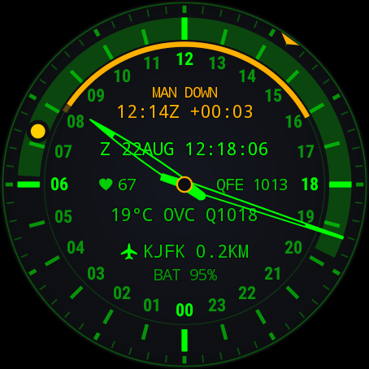
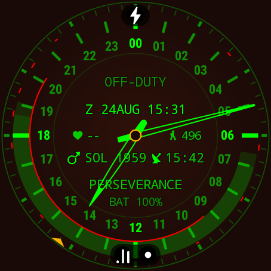

# MFD-24

[English](../../README.md) · [Français](README.fr.md) · [Deutsch](README.de.md) · **Italiano** · [日本語](README.ja.md) · [中文](README.zh.md)

**Un quadrante strumentale a 24 ore da polso** — pensato per chi monta di guardia: piloti,
naviganti, operatori di droni, ufficiali di servizio.

La lancetta delle ore compie un giro al giorno. Il proprio turno è disegnato come un arco di quel
giorno e si consuma mentre viene servito. Un monitor «uomo morto» opzionale chiede un segno di
vita a intervalli regolari, se nessuno risponde passa all'SOS e lascia una registrazione
`MAN DOWN` che una manica non può cancellare. Il resto del quadrante porta la telemetria di cui un
turno ha davvero bisogno: ora Zulu con gruppo data-orario, QNH, meteo in abbreviazioni METAR,
l'aeroporto o il porto più vicino, le ore di luce rimanenti.

| Always-on (AUTO, di notte) | Turno in corso | MAN DOWN |
|---|---|---|
|  |  |  |


## L'essenziale

- **Quadrante 24 h** — mezzogiorno in alto, mezzanotte in basso (o viceversa). La lancetta dei
  minuti gira sul proprio anello a 60 divisioni; i secondi sono un cursore che scatta di tacca in
  tacca — nulla spazza il quadrante.
- **Il turno come arco** — avvio immediato o programmato, conto alla rovescia `DUTY: 02:29 REM`,
  segnale acustico e vibrazione a entrambi i confini, anche a schermo spento.
- **Vigilanza** — un impulso al polso ogni 5/10/15 minuti, 30 secondi per rispondere con un gesto
  o un tocco, poi un SOS a raffiche: trenta secondi di chiamata, quindi un SOS doppio una volta al
  minuto, quattro volte — sentito una volta, suonato due, con volume regolabile. Senza risposta:
  `MAN DOWN`, l'istante Zulu, un segno sull'arco, un registro di questo turno — porta i dati del
  turno, e il turno successivo lo azzera. In opzione il polso
  durante il controllo mancato, letto contro l'ultimo polso in movimento. Fuori dal polso si
  sospende — e il quadrante lo dichiara.
- **Nadir** — le ore fra alba e tramonto alla propria posizione, calcolate offline, giorno e notte
  polari compresi.
- **Marca solare e lunare** — il sole e la luna sull'anello delle ore, al loro vero angolo orario;
  la luna porta la sua fase reale. Puntate la marca verso l'astro stesso e il quadrante diventa una
  bussola, di giorno come di notte.
- **Aggancio sito a 5 km** — 9 649 aeroporti, porti, eliporti e basi di lancio in un indice di
  bordo da 194 KB. Silhouette distinta per tipo; i siti militari nel colore d'accento.
- **Always-on onesto** — lo stesso quadrante, attenuato. `AUTO` lo riduce a un pixel su due dopo
  il tramonto — mai durante un turno di notte.
- **Offline per principio** — solo il meteo e un controllo quotidiano delle release su GitHub
  toccano la rete. Una nuova release si annuncia una volta sola e si installa dall'orologio,
  dove la piattaforma lo consente. Nessuna app companion, nessun account,
  nessuna telemetria verso terzi.

## MFD-24-Mars

Lo stesso strumento, un pianeta più in là: un quadrante separato che si installa **accanto** a
MFD-24 e tiene l'ora di un rover — `PERSEVERANCE` o `CURIOSITY`. La lancetta delle ore compie un
giro per sol (24 h 39 m), la banda Nadir porta il giorno marziano con le sue spalle di
crepuscolo, e due linee sull'anello delle ore segnano le finestre di collegamento: il canale
diretto con la Terra all'interno (meccanica celeste, offline), i passaggi dei relè MRO, Odyssey
e TGO all'esterno (effemeridi JPL Horizons). Dopo il sol di missione, dietro un'antenna: il tempo
di volo della luce verso la Terra, in diretta.



## Installazione

Wear OS 3.0+ (API 30). Scaricare `app-earth-release.apk` dall'
[ultima release](https://github.com/amorroma1/expedition24/releases/latest) e installare via ADB:

```
adb install -r app-earth-release.apk
```

La guida completa — tre percorsi, da « solo un telefono » alla compilazione dal sorgente, con la
risoluzione dei problemi — è in **[INSTALL.it.md](INSTALL.it.md)**. MFD-24 non è su Google Play,
di proposito; la guida spiega perché.

## Licenza

GPL-3.0-or-later. Basi navali ed eliporti provengono da OpenStreetMap (© contributori OSM, ODbL).
